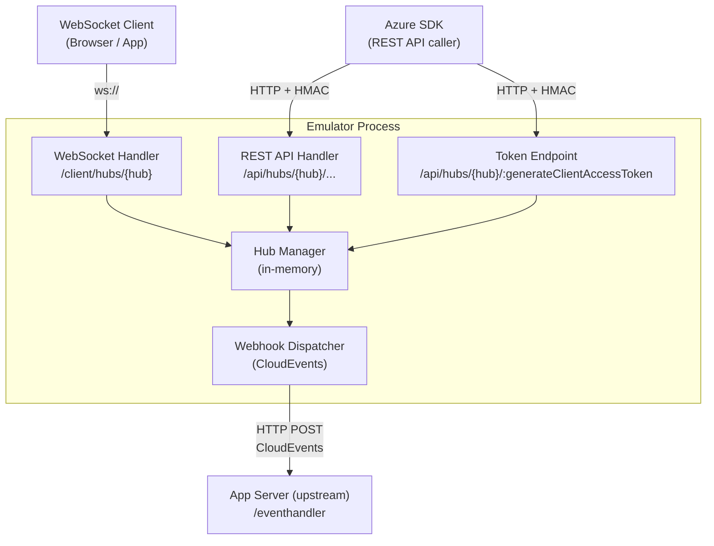
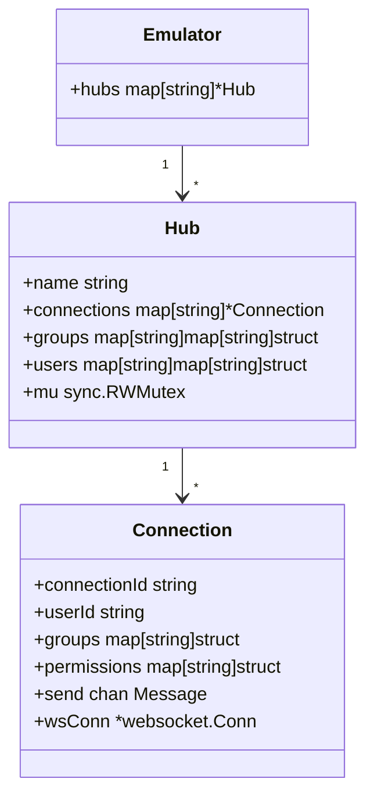
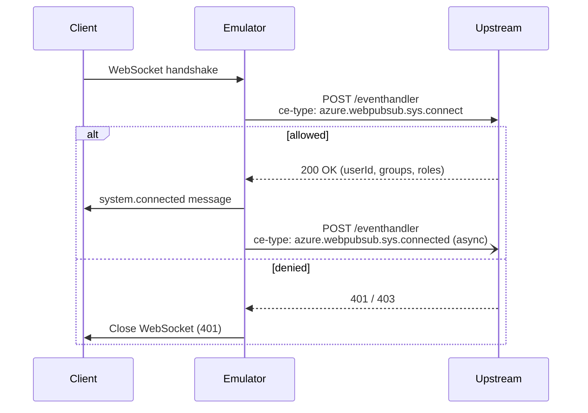
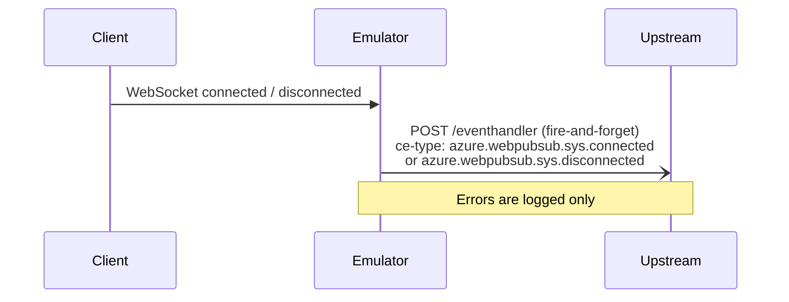
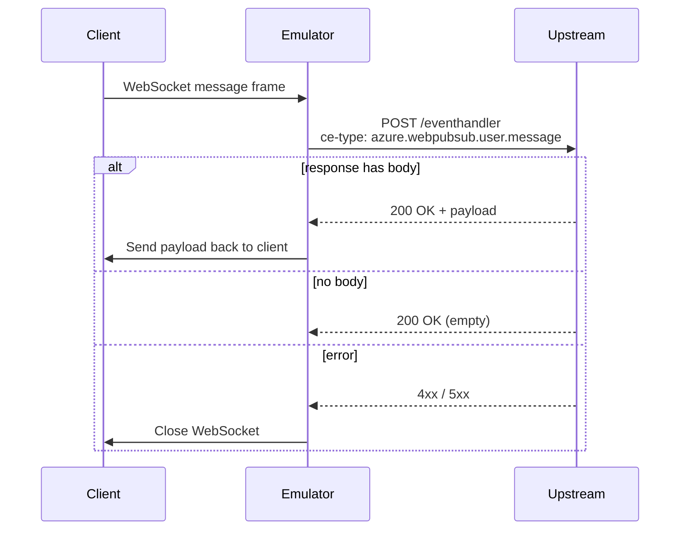

# Architecture

## Overview

Azure Web PubSub Emulator is a local server that replicates the Azure Web PubSub service protocol for local development and testing. It is SDK-compatible: applications using the official Azure Web PubSub SDKs can switch to the emulator by changing only the connection string endpoint.



## Component Responsibilities

### HTTP Server
- Routes incoming HTTP/WebSocket requests
- Middleware: HMAC-SHA256 authentication (REST API only)
- Middleware: Request logging

### WebSocket Handler
- Upgrades HTTP connections to WebSocket at `ws://localhost:{port}/client/hubs/{hub}?access_token={jwt}`
- Validates the JWT access token (signed with the configured AccessKey)
- Assigns a unique `connectionId` per connection
- Dispatches lifecycle events to the Webhook Dispatcher
- Forwards incoming client messages to the Webhook Dispatcher

### REST API Handler
- Implements the Azure Web PubSub Data Plane REST API
- All endpoints require HMAC-SHA256 authentication (same algorithm as the Azure service)
- Delegates connection/group/user operations to the Hub Manager

### Hub Manager
- Central in-memory state store
- Manages per-hub state: active connections, group memberships, user→connection mappings
- Provides thread-safe operations (sync.RWMutex)
- Sends messages to individual connections or broadcasts to groups/users

### Webhook Dispatcher
- Sends CloudEvents HTTP POST requests to the configured upstream URL per hub
- Handles the blocking `connect` event (waits for upstream response before completing WS handshake)
- Handles async events: `connected`, `disconnected`, `message`
- Implements CloudEvents Abuse Protection (WebHook-Request-Origin validation)

### Auth
- **HMAC-SHA256 validation**: Validates `Authorization` headers on REST API requests using the configured AccessKey
- **JWT generation**: Issues client access tokens (`/api/hubs/{hub}/:generateClientAccessToken`) signed with the AccessKey

## Connection String Format

The emulator uses the same connection string format as the Azure service, enabling SDK compatibility:

```
Endpoint=http://localhost:7290;AccessKey=<key>;Version=1.0;
```

Example for local development:
```
Endpoint=http://localhost:7290;AccessKey=AAAAAAAAAAAAAAAAAAAAAAAAAAAAAAAAAAAAAAAAAAA=;Version=1.0;
```

The `AccessKey` value must be a Base64-encoded string of at least 32 bytes to match Azure SDK validation requirements.

## Client Connection URL

```
ws://localhost:{port}/client/hubs/{hub}?access_token={jwt}
```

The JWT is obtained from:
1. The emulator's token endpoint (`POST /api/hubs/{hub}/:generateClientAccessToken`)
2. Generated locally by the SDK using the connection string AccessKey

## In-Memory State Model



## CloudEvents Event Flow

### Blocking: `connect`



### Async: `connected` / `disconnected`



### Blocking: `message` (simple WebSocket)



## Distribution

- **Binary**: Built with `go build`, cross-compiled for Linux/macOS/Windows
- **Docker image**: Single-binary image based on `gcr.io/distroless/static`
- **Docker Compose**: Sample `docker-compose.yml` for integration into local dev stacks
- **Configuration**: YAML file mounted at runtime; overridable via environment variables and CLI flags
